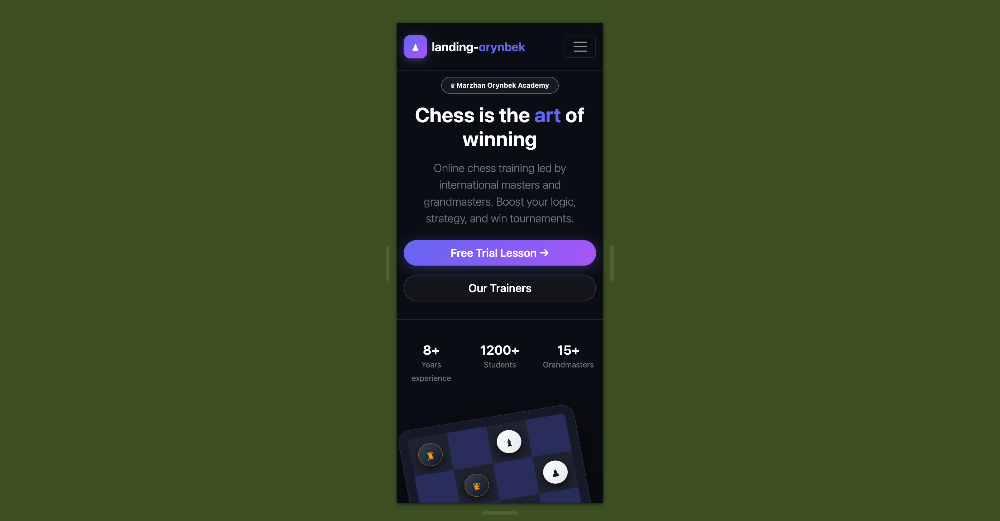
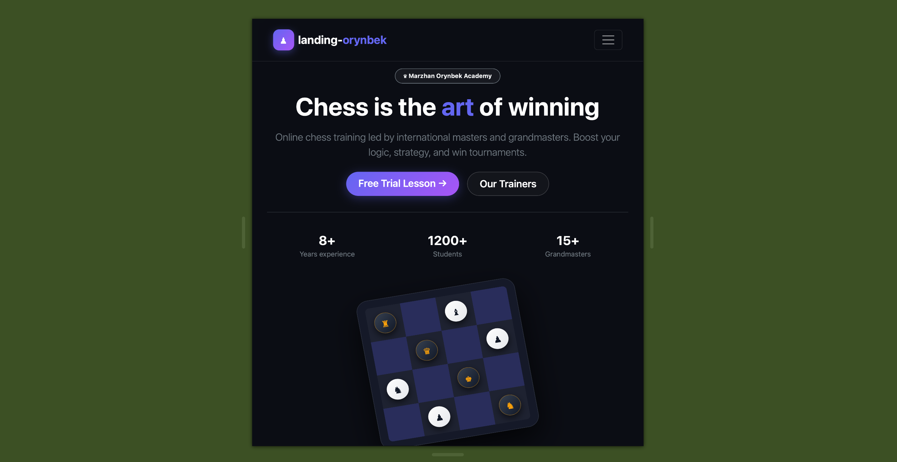
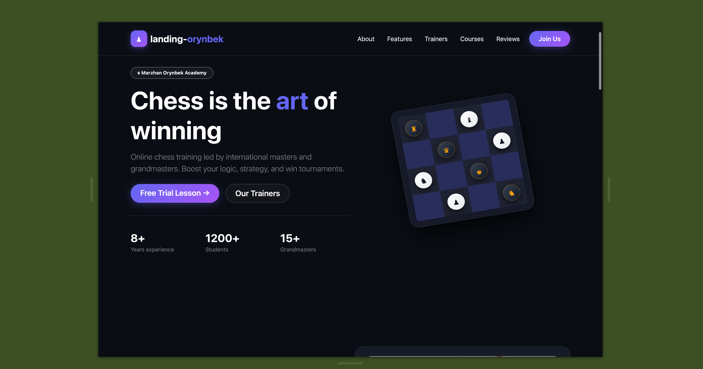

# ChessOnline — Online Chess Academy (Lab 3)

Проект лендинга онлайн-школы шахмат Маржан Орынбек, выполненный в рамках Лабораторной работы №3.

## Track
**B. Bootstrap 5** (CDN `bootstrap.bundle.js`, Grid container, Navbar toggler, Cards, CSS Variables).

## Why this tool
Bootstrap 5 — это отличный фреймворк для быстрого создания адаптивных интерфейсов. Он сильно ускоряет работу за счет готовых компонентов, таких как Navbar с кнопкой-гамбургером и адаптивная сетка (Grid system). Сетка `col-12 col-md-6 col-lg-4` позволяет без написания собственных media queries легко адаптировать сайт под телефоны, планшеты и ПК. Главное отличие Bootstrap от чистых CSS Grid/Flexbox или Sass — наличие готовых JavaScript-интерактивностей (например, выпадающее меню) и утилитарных классов. Однако при кастомизации дизайна стандартные стили фреймворка иногда перебивают собственные, поэтому важным плюсом Bootstrap 5 стала возможность переопределять цвета и шрифты через CSS-переменные (`:root`), избегая использования `!important`.

## AI Tools
При разработке и верстке использовались сервисы ChatGPT и Gemini для генерации текста и консультации по классу сетки Bootstrap.

## Responsive
Скриншоты адаптивности для трех точек останова (Breakpoints):

### Mobile (375px)

### Tablet (768px)

### Desktop (1280px)

